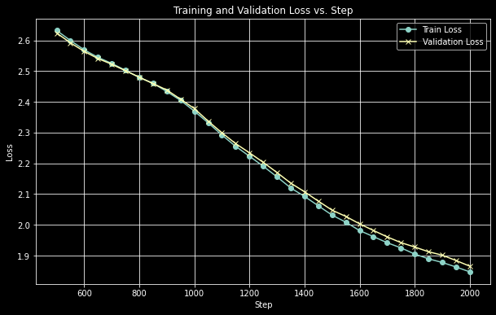
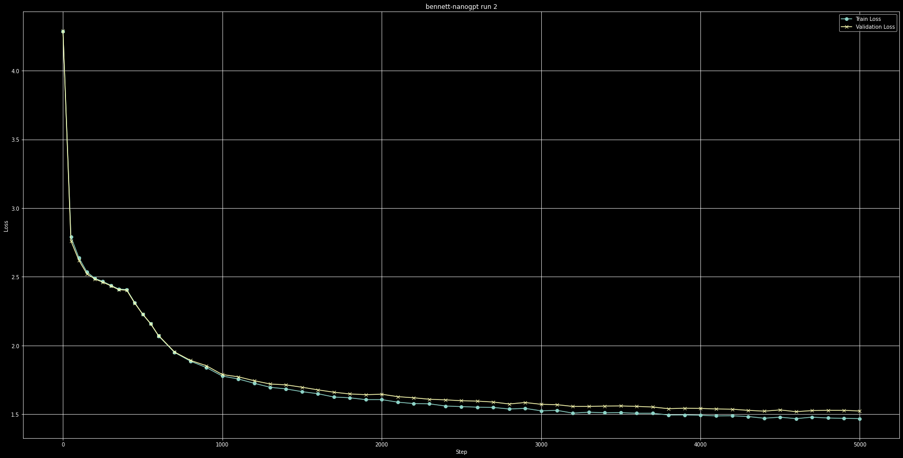

# bennett-nanogpt

A version of Andrej Karpathy's nanogpt trained on public domain works of Jane Austen. 

## Run plots

Run 1: After 3000 epochs with the full context (~25K lines of text) 

Run 2: After 5000 epochs with the shortened context (~5K lines of text) 

