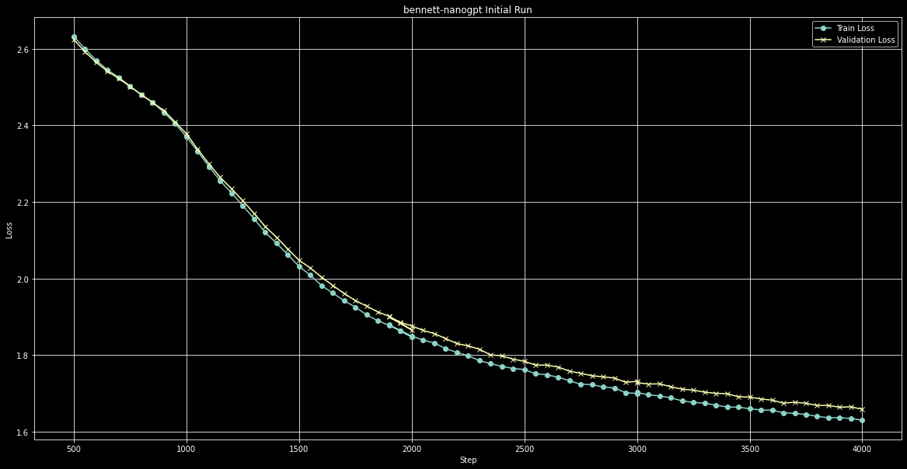
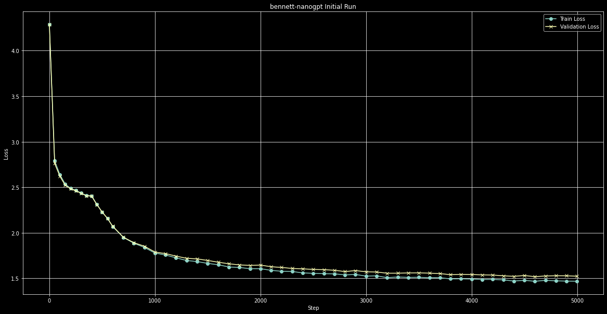
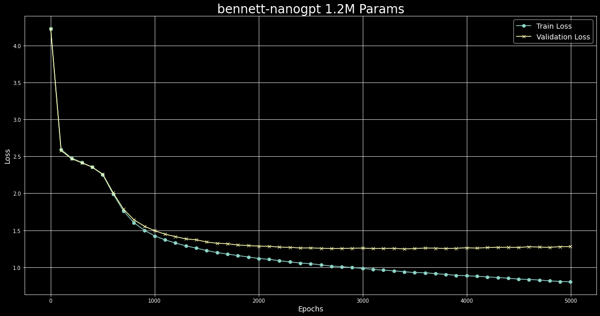

# bennett-nanogpt

A version of Andrej Karpathy's nanogpt trained on public domain works of Jane Austen. 

## Run plots

Run 1: After 4000 epochs with the full context (~25K lines of text) 

Run 2: After 5000 epochs with the shortened context (~5K lines of text) 

*The little jerk after 400 epochs is due to a changed learning rate to optimize better for the hardware the model was running on.*

Run 3: After 5000 epochs with a larger embedding size of 128

### If you want to try out the model: 

- Just download the model 
- Run the bennett_generate.py file
- Provide a starting prompt
- When asked for the model file, point to weights.pt
- Provide a temp (between 0 and 2)
- You should have an output! 

#### If you want to look through the code, I extensively added comments to every line. Mainly did that for my own learning, but if it helps you, even better! 

P.S I'm a noob to the AI/LLM field and still have a lot to learn. If you think this can be improved of if you have ideas for other cooler/better projects, just hit me up. :) 